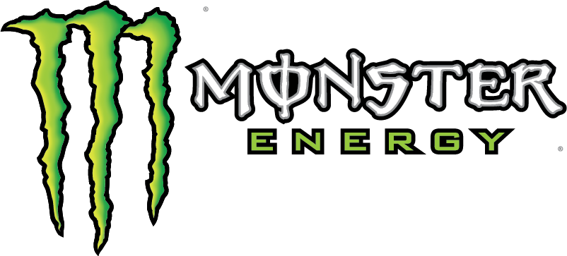

<div align="center">

# ⚡ Monster Energy — Site Demonstrativo

**Projeto educacional de HTML, CSS e JavaScript**



> 🇧🇷 *Projeto fictício criado para fins de estudo. Não afiliado à Monster Energy.*

</div>

---

## 📚 Sumário

- [📖 Sobre o Projeto](#-sobre-o-projeto)
- [🔗 Site Oficial](#-site-oficial)
- [🛠️ Tecnologias Utilizadas](#️-tecnologias-utilizadas)
- [📁 Estrutura de Arquivos](#-estrutura-de-arquivos)
- [🗂️ Páginas do Site](#️-páginas-do-site)
- [🎨 Identidade Visual](#-identidade-visual)
- [⚙️ Funcionalidades](#️-funcionalidades)
- [🖼️ Produtos](#️-produtos)
- [🚀 Como Executar](#-como-executar)
- [📱 Responsividade](#-responsividade)
- [🔍 SEO e Performance](#-seo-e-performance)
- [⚠️ Aviso Legal](#-aviso-legal)
- [📄 Licença](#-licença)

---

## 📖 Sobre o Projeto

Este é um **site completo da Monster Energy** desenvolvido em **HTML5, CSS3 e JavaScript puro** (sem frameworks), como projeto de estudo e prática de front-end.

O site apresenta:

- Um **hero** com a marca em destaque (fonte *Bebas Neue*) e uma lata 3D em destaque;
- Uma **vitrine de produtos** com fotos reais de latas (imagens com fundo transparente);
- Uma seção de **características / benefícios** da bebida;
- Uma seção **Sobre** com a história da marca;
- Uma página completa de **Produtos** com todos os sabores;
- Uma página de **FAQ (Perguntas Frequentes)** em formato de acordeão.

> ⚠️ **Importante:** Todo o conteúdo é **fictício/demonstrativo** e serve apenas para **aprendizado**. As imagens e textos pertencem à Monster Energy Company.

---

## 🔗 Site Oficial

O site oficial da marca pode ser acessado nos links abaixo:

<div align="center">

| 🌐 Site | Versão em Português (Brasil) |
|:---:|:---:|
| [**monsterenergy.com**](https://www.monsterenergy.com/) | [**www.monsterenergy.com/pt-br**](https://www.monsterenergy.com/pt-br/) |

</div>

Links úteis:

- 🏠 [Página Inicial Oficial](https://www.monsterenergy.com/)
- 🇧🇷 [Site Oficial em Português](https://www.monsterenergy.com/pt-br/)
- ❓ [Página de FAQ Oficial](https://www.monsterenergy.com/pt-br/faqs/)

---

## 🛠️ Tecnologias Utilizadas

| Tecnologia | Uso |
|:---|:---|
| **HTML5** | Estrutura semântica das páginas |
| **CSS3** | Estilização, animações e responsividade |
| **JavaScript (Vanilla)** | Interações (menu, tilt 3D, scroll reveal) |
| **Google Fonts** | Tipografia (Anton, Bebas Neue, Oswald) |
| **SVG Inline** | Ícones vetoriais (sem emojis) |

---

## 📁 Estrutura de Arquivos

```
Monster/
├── index.html          # Página inicial (home)
├── produtos.html       # Página de produtos (todos os sabores)
├── faq.html            # Página de FAQ (perguntas frequentes)
├── style.css           # Folha de estilos principal
├── script.js           # Lógica de interação (JS)
└── assets/
    ├── images/         # Imagens (latas 3D, logo, banner de fundo)
    │   ├── monster-logo.png            # Logo completa (garra + texto)
    │   ├── logo.jpg                    # Logo (usada como favicon)
    │   ├── hdr-bg-fundo.webp           # Banner de fundo do topo
    │   ├── Monster energy original.webp
    │   ├── Monster Energy Ultra Violet.webp
    │   ├── Monster Energy Juice Mango Loco.webp
    │   ├── Monster Energy Juice Pacific Punch.webp
    │   ├── Monster Energy Juice Pipeline Punch.webp
    │   ├── Monster Energy Absolutely Zero (ultra blue).webp
    │   ├── Monster Energy Ultra Watermelon (ultra red).webp
    │   └── Monster Ultra Strawberry Dreams (ultra rosa).webp
    └── favicon/        # Favicons (conjunto completo p/ PWA)
        ├── favicon.ico
        ├── favicon-16x16.png
        ├── favicon-32x32.png
        ├── android-chrome-192x192.png
        ├── android-chrome-512x512.png
        ├── apple-touch-icon.png
        └── site.webmanifest
```

---

## 🗂️ Páginas do Site

### 1. **Home** (`index.html`)

A página inicial contém:

| Seção | Descrição |
|:---|:---|
| **Navbar** | Logo + navegação (Produtos, Energia, Sobre, FAQ) |
| **Hero** | Título "MONSTER ENERGY" centralizado + lata 3D + estatísticas |
| **Produtos** | Vitrine com **8 sabores** + botão "Ver todos os sabores" |
| **Recursos** | 4 cards com ícones SVG (energia, sabor, zero açúcar, ação) |
| **Sobre** | História da marca com lata em destaque |
| **Footer** | Logo, links rápidos e aviso de projeto fictício |

### 2. **Produtos** (`produtos.html`)

Página dedicada com **banner de fundo** no topo e a linha completa de sabores (8 produtos com fotos reais).

### 3. **FAQ** (`faq.html`)

Página de **Perguntas Frequentes** em formato de **acordeão** (`<details>/<summary>`), com 5 categorias:

- 📦 Informações de Produto
- 🏢 Oportunidades Corporativas
- 🏅 Oportunidades de Patrocínio
- 🎪 Oportunidades de Eventos
- ❓ Questões Gerais

---

## 🎨 Identidade Visual

### Paleta de Cores

| Cor | Hex | Uso |
|:---|:---|:---|
| **Verde Monster** | `#00c805` | Cor principal da marca |
| **Verde Escuro** | `#008a04` | Variações/efeitos |
| **Fundo** | `#0a0a0b` | Fundo principal (preto) |
| **Painel** | `#1c1c1f` | Cards e painéis |
| **Texto** | `#f2f2f2` | Texto principal |
| **Texto Apagado** | `#9a9aa0` | Textos secundários |

### Tipografia

| Fonte | Uso |
|:---|:---|
| **Anton** | Títulos e destaques |
| **Bebas Neue** | Título do hero (variação) |
| **Oswald** | Corpo do texto |

### Ícones

Ícones **SVG inline** (estilo *Feather Icons* / código aberto) — sem emojis, garantindo consistência visual em qualquer dispositivo.

---

## ⚙️ Funcionalidades

### 🧭 Navegação

- **Navbar fixa** com efeito de blur ao rolar;
- **Menu hambúrguer** no mobile (abre/fecha com animação);
- **Menu mobile** fecha automaticamente ao clicar em um link;
- Navegação entre páginas (Home, Produtos, FAQ) e por âncoras (Energia, Sobre).

### 🖱️ Interações

| Funcionalidade | Descrição |
|:---|:---|
| **Tilt 3D** | As latas inclinam conforme a posição do mouse (efeito perspective) |
| **Scroll Reveal** | Elementos aparecem suavemente ao rolar a página |
| **Acordeão FAQ** | Perguntas abrem/fecham com transição suave |
| **Scroll Suave** | `scroll-behavior: smooth` para navegação por âncoras |

### ✨ Detalhes de UX

- `scroll-margin-top` para as âncoras **não ficarem escondidas** atrás da navbar fixa;
- `loading="lazy"` nas imagens (carregam só quando o usuário rola até elas);
- Barra de rolagem customizada;
- `aria-expanded` / `aria-label` no menu mobile (acessibilidade).

---

## 🖼️ Produtos

O site exibe os seguintes sabores (com fotos reais):

| # | Produto | Arquivo |
|:---:|:---|:---|
| 1 | **Original** | `Monster energy original.webp` |
| 2 | **Ultra Violet** | `Monster Energy Ultra Violet.webp` |
| 3 | **Mango Loco** | `Monster Energy Juice Mango Loco.webp` |
| 4 | **Pacific Punch** | `Monster Energy Juice Pacific Punch.webp` |
| 5 | **Pipeline Punch** | `Monster Energy Juice Pipeline Punch.webp` |
| 6 | **Ultra Blue (Absolutely Zero)** | `Monster Energy Absolutely Zero (ultra blue).webp` |
| 7 | **Ultra Watermelon** | `Monster Energy Ultra Watermelon (ultra red).webp` |
| 8 | **Ultra Strawberry Dreams** | `Monster Ultra Strawberry Dreams (ultra rosa).webp` |

---

## 🚀 Como Executar

Como é um site **estático** (HTML/CSS/JS), basta abrir qualquer arquivo `.html` no navegador.

### Opção 1 — Abrir direto

Dê **duplo clique** em `index.html` ou arraste para o navegador.

### Opção 2 — Servidor local (recomendado)

Com **Python**:
```bash
cd caminho/do/projeto
python -m http.server 8000
# Acesse: http://localhost:8000
```

Com **Node.js** (via `npx serve`):
```bash
npx serve .
```

### Requisitos

- Um navegador moderno (Chrome, Firefox, Edge, Safari);
- Conexão com a internet (para as fontes do Google Fonts).

---

## 📱 Responsividade

O site se adapta a diferentes tamanhos de tela via media queries:

| Breakpoint | Comportamento |
|:---|:---|
| **> 900px** | Layout desktop (grid de produtos em várias colunas) |
| **≤ 900px** | Hero centralizado, menu vira hambúrguer, paddings reduzidos |
| **≤ 500px** | Grade de produtos em 2 colunas, estatísticas compactadas |

---

## 🔍 SEO e Performance

- ✅ **Meta description** em todas as páginas;
- ✅ **Título** otimizado por página (`<title>`);
- ✅ **Favicons** em vários formatos + **manifest** (PWA-ready);
- ✅ **`loading="lazy"`** nas imagens (melhor performance);
- ✅ **Ícones SVG** (leves e nítidos em qualquer resolução);
- ✅ **Fontes do Google Fonts** com `preconnect` (carregamento mais rápido).

---

## ⚠️ Aviso Legal

> **Este projeto é de caráter estritamente educacional/demonstrativo.**
>
> - **Não é afiliado, endossado ou patrocinado** pela Monster Energy Company;
> - As **marcas, logos e imagens** pertencem à Monster Energy Company;
> - O conteúdo do **FAQ** foi reproduzido da página oficial apenas para fins de estudo;
> - **Não deve ser publicado nem usado comercialmente** sem autorização;
> - Se você é representante da marca e deseja a remoção deste material, entre em contato.

---

## 📄 Licença

Este projeto é um **trabalho de estudo pessoal**. O código-fonte (HTML, CSS e JS) pode ser usado livremente para fins educativos. As **marcas e imagens** da Monster Energy são de propriedade de seus respectivos donos.

---

<div align="center">

**Feito com 🔥 para fins educativos | Monster Energy — Unleash the Beast 🐾**

</div>
